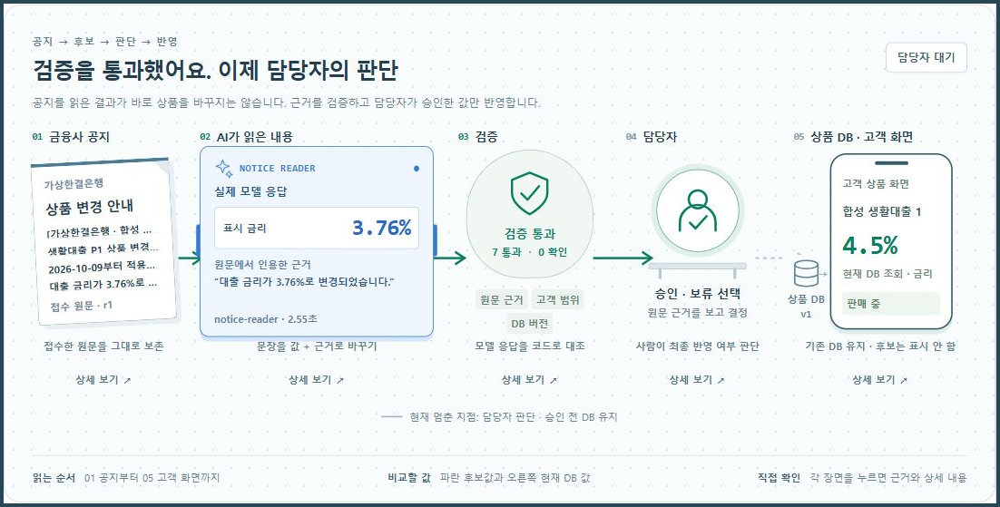
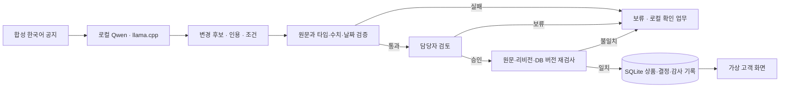
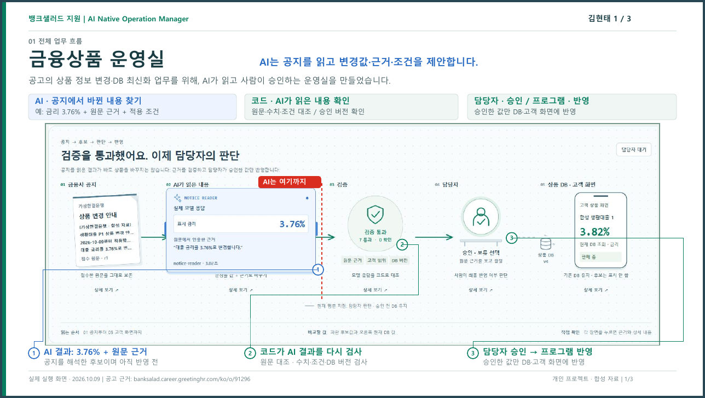
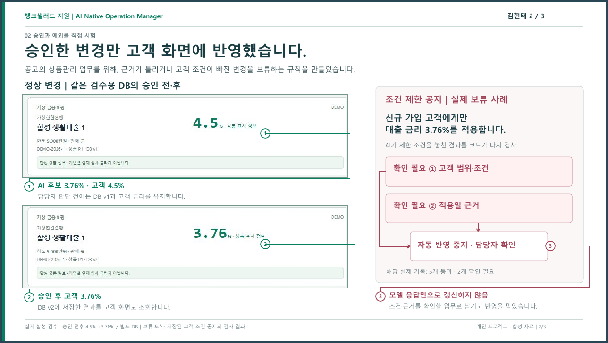
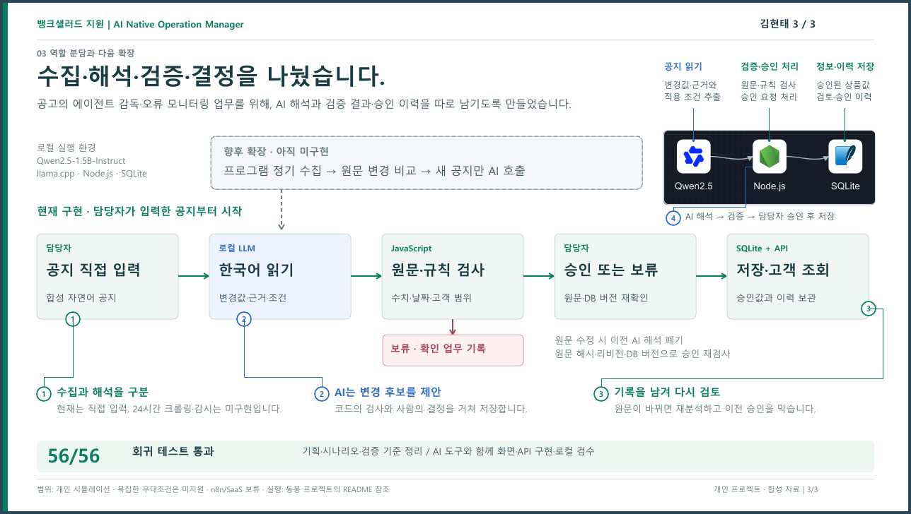

# 금융상품 운영실 · AI 공지 검토

**금융사 공지를 AI가 읽고, 코드가 검증하고, 담당자가 승인하면 상품 DB와 가상 고객 화면이 바뀌는 실행형 데모입니다.**

뱅크샐러드 [AI Native Operation Manager 공고](https://banksalad.career.greetinghr.com/ko/o/91296)의 **상품 정보 변경·상품 DB 최신화 업무를 위해, 자연어 공지에서 변경값과 적용 조건을 읽어 담당자의 검토를 돕는 운영실을 만들었습니다.**

가상 금융사와 합성 공지를 사용한 개인 포트폴리오입니다. **로컬 LLM 추론, 검증, 승인, SQLite 저장은 실제로 실행**되며, 아래 고객 화면은 승인된 데모 DB를 조회합니다.

**[▶ 시연 영상 보기](https://youtu.be/XPwjsHmasuI)** · **[3페이지 포트폴리오 PDF](docs/portfolio/financial-product-ops-portfolio.pdf)** · [검수 기록](VERIFICATION.md)

영상은 실제 브라우저 조작에서 얻은 정지 화면을 장면별로 편집한 **112초 무음·한국어 자막 시연**입니다. 연속 녹화가 아니며, 영상 장면 길이와 실제 처리시간은 다릅니다. 실행별 실제 추론 시간은 앱에서 확인할 수 있습니다.

[](https://youtu.be/XPwjsHmasuI)

<table><tr><td></td></tr></table>

*전체 업무 모식도 — 왼쪽부터 원문 → AI 후보 → 검증 → 담당자 → 고객 화면을 읽습니다. 후보 금리와 현재 고객 금리를 구분해 승인 전후의 변화를 확인합니다.*

## 60초 안에 볼 핵심

| 순서 | 볼 곳 | 확인할 내용 |
|---|---|---|
| 1 | 큰 업무 모식도 | AI가 읽은 **후보값**과 DB의 **현재값**이 나뉘어 있습니다. |
| 2 | AI 카드와 원문 근거 | AI의 근거 문장을 누르면 접수 원문의 해당 문장이 강조됩니다. |
| 3 | 검증·담당자 장면 | 검증을 통과해도 승인 대기이며, 담당자가 승인해야 DB가 바뀝니다. |
| 4 | 보류·오류 장면 | 조건 누락, 원문 변경, 모델 실패가 발생하면 반영을 멈추고 이유를 남깁니다. |

처음에는 영상을 보거나 아래 화면을 따라가세요. 직접 실행할 때는 [빠른 시작](#빠른-시작--windows)을 이용하면 됩니다.

## 실제 화면으로 보는 한 건의 처리

### 1. AI가 변경 후보와 근거를 만듭니다

합성 공지를 입력하고 **AI로 공지 읽기**를 누르면 실제 Qwen 모델이 변경값, 적용일, 조건, 확인할 질문을 생성합니다. 화면에 나온 답을 서버가 그대로 승인하지는 않습니다.

<table><tr><td></td></tr></table>

*원문과 AI 해석 — 변경값뿐 아니라 그 값이 나온 문장을 함께 확인합니다. 모델이 잘못 읽은 내용도 결과에 그대로 드러납니다.*

### 2. 코드가 원문과 조건을 대조합니다

타입·허용 필드·수치·적용일·인용문·고객 범위 등을 검사합니다. 상품 식별자와 버전은 모델에 맡기지 않고 서버가 선택한 상품과 원문에 연결합니다.

<table><tr><td></td></tr></table>

*검증 결과 — 통과 항목과 실패 이유를 볼 수 있습니다. 통과는 담당자가 검토할 수 있다는 뜻이며, 아직 상품 변경이 완료된 상태는 아닙니다.*

### 3. 담당자 승인 후 DB와 고객 화면이 함께 바뀝니다

**확인한 변경 승인**을 누르면 서버가 원문 해시·리비전·현재 DB 버전을 다시 검사합니다. 상품 변경과 결정 기록을 하나의 SQLite 트랜잭션으로 저장하고, 가상 고객 화면이 같은 DB의 결과를 읽습니다.

<table><tr><td></td></tr></table>

*승인 결과 — 새로운 데모 DB의 정상 사례는 4.50% → 3.76%로 바뀝니다. 반복 실행에서는 현재 DB 값과 입력 후보가 달라질 수 있습니다.*

### 4. 반영하면 안 되는 경우도 직접 시험할 수 있습니다

**조건 누락:** “신규 고객에게만 적용” 같은 제한을 모델이 놓치더라도 코드가 감지하면 보류합니다. 현재 구현은 모든 고객에게 적용하는 단순 공지를 중심으로 검증합니다.

<table><tr><td></td></tr></table>

*보류 결과 — 확인 업무가 생기며, 검증 실패한 후보는 고객 금리에 반영되지 않습니다.*

<details>
<summary><strong>조건 누락과 검증 실패를 상세 화면으로 확인하기</strong></summary>

<table><tr><td></td></tr></table>

*이번 실제 실행에서 AI는 고객 조건을 놓쳤고 인용문도 바꿨습니다. 코드가 두 항목을 차단해 상품 DB v2를 유지했습니다.*

</details>

**검토 중 원문 변경:** 원문을 수정하면 이전 AI 해석을 폐기합니다. **이전 검토로 승인 시도**는 거절되며, 현재 원문을 다시 분석해야 합니다.

<table><tr><td></td></tr></table>

*오래된 검토 차단 — 원문의 리비전과 DB 버전이 분석 시점에 연결되어 있습니다. 과거 후보를 현재 상품에 덮어쓸 수 없습니다.*

**모델 연결 실패:** 모델이 응답하지 않으면 오류를 표시합니다. 성공한 것처럼 샘플 응답을 보여주지 않으며 상품 DB를 유지합니다.

<table><tr><td></td></tr></table>

*모델 오류 — 모델 실행 상태를 확인한 뒤 다시 분석할 수 있습니다. 이 화면은 별도 합성 DB에서 연결 실패를 유도해 확인한 사례입니다.*

**원문에 없는 인용:** 공개 시연 준비 중 정상 금리 공지를 읽는 첫 시험에서도 모델이 “금리는”을 “금리가”로 바꿔 인용했습니다. 변경값이 맞아 보여도 원문 인용 대조에 실패해 보류됐습니다.

<table><tr><td></td></tr></table>

*근거 실패 — 코드가 실제 원문과 모델의 인용문을 대조합니다. 이 사례는 모델이 항상 정확하게 읽는다는 가정 없이 반영 경계를 시험한 결과입니다.*

## AI·코드·사람은 각각 무엇을 하나요?

| 주체 | 맡은 일 | 반영 권한 |
|---|---|---|
| **로컬 LLM** | 한국어 공지에서 변경 후보·원문 인용·적용 조건·질문 생성 | DB 변경 권한 없음 |
| **검증 코드** | 원문 근거·형식·수치·날짜·고객 범위 검사, 오래된 결과 거절 | 검증 실패 시 반영 차단 |
| **담당자** | 검증된 후보의 승인 또는 보류, 복잡한 조건과 예외 판단 | 승인 요청 |
| **서버·SQLite** | 승인 직전 재검증, 상품 변경·결정·감사 기록 저장 | 검증과 승인 조건 충족 시 저장 |
| **가상 고객 화면** | 승인된 상품 정보를 같은 DB에서 조회 | 조회만 수행 |

## 빠른 시작 · Windows

**필요한 것:** Windows x64, PowerShell, **Node.js 24.19 이상 24.x**, 최초 모델 설치용 인터넷 연결. Node.js는 [공식 다운로드](https://nodejs.org/en/download)에서 설치할 수 있습니다.

이 저장소는 소스와 문서만 제공합니다. **`package.json`과 npm 의존성이 없어 `npm install`은 필요 없습니다.** 모델 가중치와 llama.cpp 실행 파일은 저장소에 포함하지 않습니다. 계정이나 클라우드 API 키도 필요 없습니다.

저장소를 내려받아 압축을 푼 뒤, 프로젝트 폴더에서 PowerShell을 엽니다.

```powershell
# 처음 한 번: 공식 모델과 런타임 다운로드 및 SHA256 확인
.\llm-local.ps1 -Mode Install

# 로컬 모델 시작
.\llm-local.ps1 -Mode Start

# 앱 시작 — 이 터미널을 열어 두세요
.\start.ps1
```

브라우저에서 **[http://127.0.0.1:4318](http://127.0.0.1:4318)**을 엽니다. 앱은 `start.cmd`를 두 번 눌러 시작할 수도 있습니다. 다음 실행부터는 `Install`을 생략합니다.

| 구성 | 사용 버전·주소 |
|---|---|
| 모델 | **Qwen2.5-1.5B-Instruct Q4_K_M** · 약 1.12GB |
| 모델 서버 | **llama.cpp b11429 · Windows Vulkan x64** · ZIP 약 33MB |
| 모델 주소 | `http://127.0.0.1:8089` · 별칭 `notice-reader` |
| 앱 주소 | `http://127.0.0.1:4318` |
| 저장 위치 | 프로젝트 폴더의 `work/ops-runtime.sqlite` |

GPU 사용 여부와 추론 시간은 실행 환경에 따라 달라집니다. 모델·런타임은 공식 출처에서 다운로드하며 설치 스크립트가 고정된 SHA256을 확인합니다.

<details>
<summary><strong>시작이 안 될 때 · 상태 확인 · 종료</strong></summary>

```powershell
# Node 버전 확인
node --version

# 모델 연결 상태 확인
.\llm-local.ps1 -Mode Status

# 모델 종료 — 별도 터미널에서 실행
.\llm-local.ps1 -Mode Stop
```

앱 서버는 실행한 터미널에서 `Ctrl+C`로 종료합니다. 모델 도우미는 숨김 프로세스로 시작하며, `Stop`은 기록한 PID·실행 경로·별칭이 일치하는 프로세스만 종료합니다.

- **모델 미연결:** `Install` → `Start` 순서와 `work/llama-notice.err.log`를 확인하세요.
- **SHA256 불일치:** 스크립트가 실행을 중단합니다. 다운로드 실패로 남은 파일인지 확인하고 해당 파일을 다시 받으세요.
- **8089 포트 사용 중:** 다른 서비스가 사용 중이면 모델을 시작하지 않습니다. 기존 서비스의 용도를 확인하세요.
- **4318 포트 사용 중:** 별도 터미널에서 `$env:PORT='4320'`을 설정한 뒤 `start.ps1`을 실행하고 `http://127.0.0.1:4320`을 엽니다. **포트 변경만으로 DB가 분리되지는 않습니다.**
- **PowerShell 실행 정책 차단:** 앱은 `start.cmd`로 실행할 수 있습니다. 모델 도우미는 `powershell.exe -NoProfile -ExecutionPolicy Bypass -File .\llm-local.ps1 -Mode Install`처럼 해당 명령에만 정책 옵션을 지정할 수 있습니다. 이후 `Start`에도 같은 방식을 사용합니다.

</details>

## 직접 체험하는 순서

1. **새 공지 시험하기**에서 정상 샘플을 선택하고 **AI로 공지 읽기**를 누릅니다.
2. AI의 근거 문장과 검증 결과를 확인합니다. 큰 모식도의 장면을 누르면 상세 검토가 열립니다.
3. **확인한 변경 승인**을 누르고 DB 버전·고객 금리의 변경을 확인합니다.
4. 조건이 있는 공지나 날짜가 빠진 공지를 선택해 보류 이유와 고객 금리 유지를 확인합니다.
5. 검토 중 원문을 수정한 뒤 **이전 검토로 승인 시도**로 차단을 확인합니다. 이어 **현재 원문을 AI로 다시 읽기**를 실행합니다.
6. **공지·승인·변경 기록 저장**으로 합성 공지·AI 해석·결정·DB 기록을 JSON으로 내려받습니다.

**기록은 새로고침과 서버 재시작 후에도 유지됩니다.** 새 창·시크릿 창을 열거나 브라우저 기록을 지워도 같은 서버의 SQLite 기록은 초기화되지 않습니다. 화면의 **데모 초기화**는 현재 DB의 합성 접수·검토·결정 기록을 지우고 상품을 초기값으로 되돌립니다. 남길 기록은 먼저 저장하세요. 여러 탭도 같은 DB를 사용하므로 탭 하나에서 승인·수정·초기화한 결과가 다른 탭의 검토에 영향을 줍니다.

## 구현 범위와 한계

| 구분 | 현재 제공하는 것 |
|---|---|
| **실제 실행** | 로컬 Qwen 추론, 독립 검증, 담당자 승인·보류, SQLite 영속 저장, 고객 화면 조회, JSON 기록 내보내기 |
| **합성 데이터** | 가상 금융사·상품·공지·고객 화면. 실제 금융사 API와 고객 정보는 사용하지 않음 |
| **별도 모의 실험** | **운영 조건 비교** 탭의 가상 시간·모의 추출·인력/유입량 비교. 실제 LLM 추론이나 회사 성과 측정과 구분 |
| **보류한 연결** | n8n·Gmail·Jira·Datadog 등 외부 서비스. 기본 AI 검토 사건은 중앙 전달 함수에서 외부 전송을 차단 |
| **향후 방향** | 고객별 조건 처리, 자동 예약 적용, 평가 데이터 축적 후 자동화 범위 검토 |

실제 금융사 사이트를 순회하는 **크롤러는 없습니다.** 현재 공지 접수는 합성 샘플 선택과 직접 입력입니다. 과거 실험의 외부 연동 관련 코드가 일부 남아 있지만, 기본 AI 공지 검토에는 n8n 설치·연결이 필요하지 않습니다. 공개 자료의 외부 연결 설명은 현재 기본 데모와 구분해서 읽어야 합니다.

작은 로컬 모델은 조건을 누락하거나 날짜·인용문을 잘못 만들 수 있습니다. 실제 시험에서도 잘못된 인용문을 생성해 보류된 사례가 있습니다. 검증기는 제한된 단순 공지를 대상으로 하며, 모든 의미 오류나 프롬프트 인젝션을 막는다고 보장하지 않습니다. 복잡한 우대금리·고객별 조건·여러 날짜와 수치·만원/억 단위는 지원하지 않거나 보류합니다. 미래 적용 공지는 예약 기록만 남기며 자동 적용 스케줄러는 없습니다.

화면의 추론 시간과 처리시간은 해당 로컬 실행의 기록입니다. **회사 업무 효율, 처리시간 단축률, 모델 정확도 벤치마크를 측정한 결과가 아닙니다.**

## 제작과 검수에서 한 일

개인 프로젝트이며 **AI 코딩 도구의 도움으로 제작**했습니다. 업무를 원문 접수·AI 해석·검증·사람 판단·DB 반영으로 나누고, 승인 경계와 예외 시나리오를 정해 구현·검수를 진행했습니다.

| 제작 역할 | 공개 결과물에서의 범위 |
|---|---|
| 김현태 | 기획·시나리오·검증 기준 정리, AI 도구와 함께 화면·API 구현, 실제 모델·브라우저 검수 |
| AI 코딩 도구 | 설계·코드·문서 작성과 검수 보조. 생성된 결과를 테스트 및 실제 실행으로 확인 |

공고 업무를 바탕으로 만든 데모의 구현·검수 경험이며, 실제 금융사 운영 성과는 포함하지 않습니다.

이 프로젝트에서 보여주려는 것은 공지의 답을 한 번 생성하는 것에서 끝나지 않고, **어떤 근거를 확인하고, 언제 멈추고, 누가 승인하며, 변경 후 무엇을 다시 확인할지** 정하는 과정입니다.

```powershell
node --test
```

2026-10-09, 공개용 소스에서 Node.js 24.19.0으로 **56/56 테스트 통과 · 실패 0 · 생략 0**을 재확인했습니다. 테스트에는 없는 인용문, 조건·날짜 누락, 부정문, 중복 접수, 추론 중 원문/DB/초기화 변경, 오래된 승인, 트랜잭션 롤백, SQLite 재시작, 모델 실패, AI 사건 외부 전송 차단이 포함됩니다. 테스트의 모델 응답 검사는 대체 응답을 이용하며, 실제 모델·브라우저 검수는 [VERIFICATION.md](VERIFICATION.md)에 따로 기록했습니다.

<details>
<summary><strong>개발자를 위한 구조와 파일 안내</strong></summary>



| 파일 | 역할 |
|---|---|
| [`server.mjs`](server.mjs) | 로컬 HTTP 서버, 공지 분석·원문 수정·승인 API |
| [`notice-ai.mjs`](notice-ai.mjs) | 실제 모델 호출, JSON 스키마, 해석 결과와 원문 검증 |
| [`ops-store.mjs`](ops-store.mjs) | 원문/DB 스냅샷, SQLite 트랜잭션, 중복·과거 승인 방지 |
| [`ops-map.mjs`](ops-map.mjs) · [`ops-ui.mjs`](ops-ui.mjs) | 큰 업무 모식도와 상세 검토·고객 화면 |
| [`ops-integrations.mjs`](ops-integrations.mjs) | 로컬 확인 업무와 외부 연결 경계, AI 사건 외부 전달 제외 |
| [`core.mjs`](core.mjs) · [`app.mjs`](app.mjs) | 별도 운영 조건 비교 탭의 합성 시뮬레이션 |
| [`llm-local.ps1`](llm-local.ps1) | 공식 모델/런타임 설치·해시 확인·시작·상태·종료 |

서버는 `127.0.0.1`에서 실행합니다. 추론 시작 시 원문 해시·리비전·상품 버전·데모 세대를 저장하고, 응답 도착과 승인 직전에 다시 대조합니다. 추론 도중 원문·상품·초기화 상태가 바뀌면 늦게 도착한 결과를 거절합니다.

상품 변경과 결정 영수증은 한 트랜잭션으로 저장합니다. 같은 공지를 다시 접수하면 기존 건을 반환하며 추가 모델 호출을 만들지 않습니다. 사건의 과거 승인값과 현재 고객 DB 값도 구분해 표시합니다.

</details>

<details>
<summary><strong>공고 연결 근거와 3페이지 포트폴리오</strong></summary>

공식 공고는 상품 조건·DB 변경을 에이전트에 맡기고, 사람이 설계·감독·판단·예외를 책임지는 역할을 설명합니다. 이 데모는 그중 **자연어 공지의 변경 후보와 근거 생성 → 독립 검증 → 사람 승인 → 상품 반영** 구간을 직접 체험하도록 만들었습니다.

회사의 [한국어 입력을 제한된 DSL로 바꾸는 개발 사례](https://blog.banksalad.com/tech/banksalad-vibe-coding/)와 [LLM 테스트 데이터의 유효성을 검사하는 사례](https://blog.banksalad.com/tech/how-banksalad-testdata/)도 생성과 검증을 나누는 설계의 참고 자료로 사용했습니다. 회사가 실제로 같은 공지 시스템이나 Qwen·llama.cpp·n8n을 사용한다는 뜻은 아닙니다. 출처와 해석 범위는 [COMPANY-ALIGNMENT.md](COMPANY-ALIGNMENT.md)에 기록했습니다.

**[포트폴리오 PDF 열기](docs/portfolio/financial-product-ops-portfolio.pdf)**

<table><tr><td></td></tr></table>

*1페이지 — 직무와 제작 목적, 대표 실행 화면.*

<table><tr><td></td></tr></table>

*2페이지 — 처리 과정과 검증·예외 사례.*

<table><tr><td></td></tr></table>

*3페이지 — 구현·검수와 한계.*

</details>
