# 금융상품 운영 Agent · 공지 조사와 승인 후 반영

**AI가 공지를 조사·해석하고, 담당자가 승인한 건을 Agent에 반영 요청하면 상품 DB와 가상 고객 화면이 바뀌는 실행형 데모입니다.**

뱅크샐러드 [AI Native Operation Manager 공고](https://banksalad.career.greetinghr.com/ko/o/91296)의 **상품 정보 변경·상품 DB 최신화 업무를 위해, 자연어 공지에서 변경값과 적용 조건을 읽어 담당자의 검토를 돕는 운영실을 만들었습니다.**

가상 금융사와 합성 공지를 사용한 개인 포트폴리오입니다. **로컬 LLM 추론, 검증, 승인, SQLite 저장은 실제로 실행**되며, 고객 화면은 승인된 데모 DB를 조회합니다.

**[이전 UI의 3페이지 포트폴리오 PDF](docs/portfolio/financial-product-ops-portfolio.pdf)** · **[▶ 초기 UI 시연 영상](https://youtu.be/XPwjsHmasuI)** · [현재 UI의 조합과 검수](docs/ui-combination.md) · [검수 기록](VERIFICATION.md)

## OpenClaw Agent · 현재 구현

공고의 경쟁상품 조건 추적·상품 DB 최신화 업무를 위해, **OpenClaw에 직접 만든 금융 도구 6개를 붙여 공지 조사와 승인 후 반영을 수행하는 Agent**를 만들었습니다. Qwen이 실제 `tool_calls`로 다음 도구와 입력을 선택하고, Node.js가 도구를 실행해 결과를 돌려줍니다.

**AI:** 도구 선택 → 반환 원문 읽기 → 금리·적용일·정확한 근거 제안.<br>
**프로그램:** HTTP 수집 → 근거·출처·버전 검증 → 승인 재확인 → SQLite 저장.<br>
**사람:** 원문과 제안을 대조해 승인·보류. AI에는 승인 도구를 주지 않습니다.

<table border="1" cellpadding="8"><tr><td>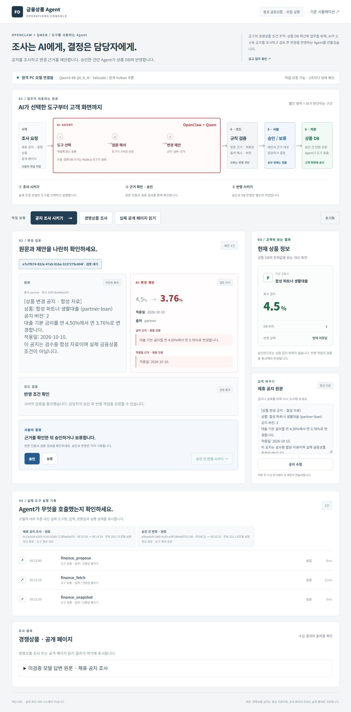</td></tr></table>

*읽는 순서 — 위의 연결선으로 전체 흐름을 보고, 가운데 원문 → 빨간 AI 후보 → 코드 검증 → 사람 판단을 대조합니다. 아래에는 실제 호출의 입력·반환값이 남습니다. 캡처 시 제안은 3.76%, 현재 DB는 4.5%였습니다. 도구 실행 시간은 Node.js 처리시간이며 모델의 추론시간과 다릅니다.*

모델은 Tailscale로 연결된 별도 PC에서 실행하고, 이 PC에는 OpenClaw·검토 화면·도구·DB를 둡니다. RAM을 합치는 구조가 아닌 **모델 추론 분리**입니다. SSH 모델 중계는 고정 모델의 세 API 경로만 전달합니다. 원격 실행과 모델 검수의 실제 결과는 [검수 기록](VERIFICATION.md), 설정·도구 권한·실행 방법은 [Agent 설명](docs/openclaw-agent.md)에 구분해 기록합니다.

<table border="1" cellpadding="8"><tr><td>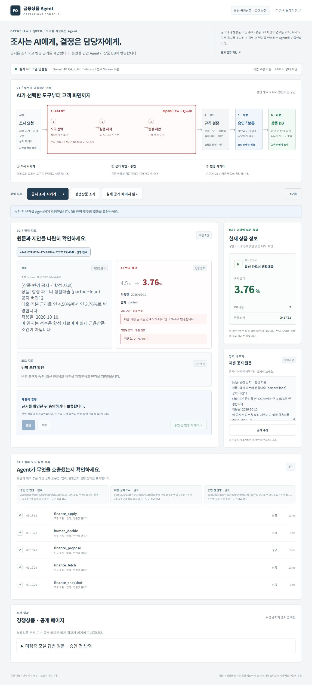</td></tr></table>

*실제 반영 — 담당자 승인 이후 별도 Agent 실행이 `finance_apply`를 호출했습니다. 현재 DB와 고객 화면은 3.76% / v2이며, 모델 실행도 정상 완료했습니다. 자동 검사 140/140 통과는 별도의 코드·권한 검사이며 모델 정확도 점수가 아닙니다.*

### 공지가 바뀌면 이전 승인으로 반영할 수 없습니다

새 3.91% 공지를 Agent가 읽고 제안한 뒤 사람이 승인했습니다. 반영 전에 공지를 3.82%로 수정하자 승인이 무효가 됐습니다. 화면의 반영 버튼이 막혔고, 별도로 실행한 **실제 Agent의 `finance_apply` 호출도 `HUMAN_APPROVAL_REQUIRED`로 거절**됐습니다. 고객 DB는 3.76% / v2를 유지했습니다.

<table border="1" cellpadding="8"><tr><td>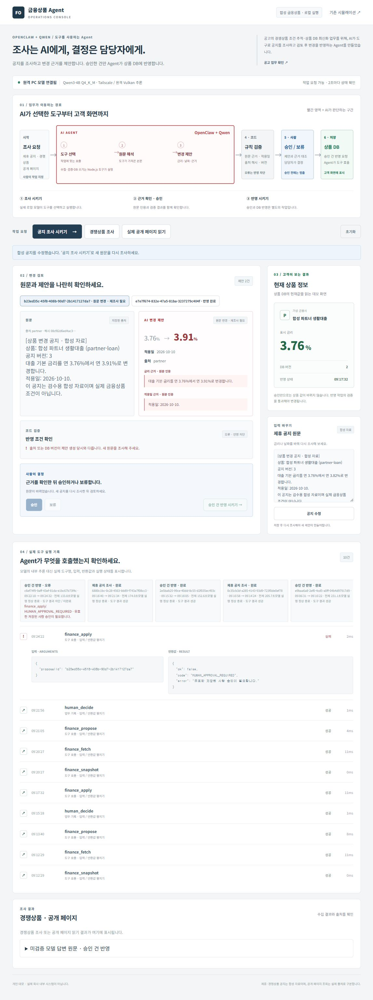</td></tr></table>

*실패를 읽는 순서 — 가운데 재조사 안내 → 오른쪽 유지된 고객 금리 → 아래 펼친 도구 입력·반환값을 확인합니다. 모델 실행은 정상 종료했지만 업무 결과는 차단입니다. [실제 호출 기록 JSON](docs/agent-demo-run.json)에는 정상 조사·반영과 이 차단 결과를 함께 보존했습니다.*

실측 전체 실행시간은 새 공지 조사 **205.7초**, 승인 후 반영 **152.6초**였습니다. OpenClaw 시작·모델 추론·SSH 전달·마지막 답변을 포함하며, 도구 자체의 몇 ms 처리시간과 다릅니다. 모델의 마지막 문장이 금리 하락을 ‘인상’으로 표현한 사례도 그대로 보존했습니다. 이 설명은 **미검증 모델 답변**으로 표시하며 DB 값이나 성공 판정에 사용하지 않습니다.

```powershell
# 자동 검사 (Node.js 24)
node --test

# 설치 및 로컬 작은 모델 실험용 실행
powershell -NoProfile -File agent/start.ps1 -Install
```

콘솔: <http://127.0.0.1:4330/>. **1.7B 로컬 모델의 전체 업무 성공을 보장하지 않습니다.** 실제 검수에는 Qwen3-4B를 사용하며 원격 실행 절차를 별도로 제공합니다. 24시간 감시와 n8n은 현재 범위에 포함되지 않습니다. 아래 PDF·영상과 기존 운영실 화면은 앞선 단일 분석 방식의 기록입니다.

## 이전 운영실 UI · 공지에서 상품 정보까지

**한눈에 흐름을 보고, 근거를 확인한 뒤, 바로 옆에서 결정합니다.** 간결한 연결선, 문서의 공간감, 근거를 펼쳐 보는 구성을 금융상품 정보 변경 업무에 맞춰 조합했습니다.

<table border="1" cellpadding="8"><tr><td>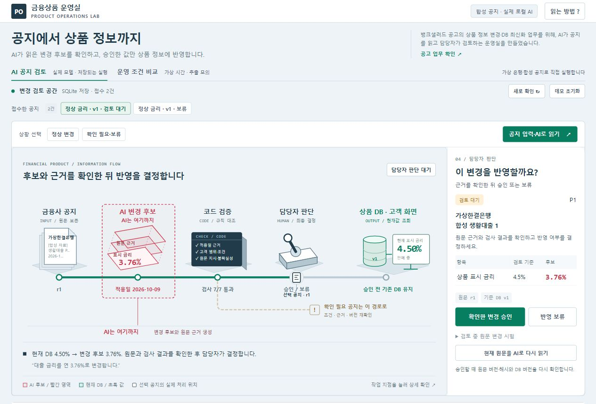</td></tr></table>

*승인 전 — 빨간 3.76%는 AI의 변경 후보, 초록 4.50%는 현재 DB 값입니다. ‘AI는 여기까지’ 경계는 후보·원문 근거 생성까지를 표시합니다. 이 화면은 실제 검수 중 저장한 상태이며 이후 초기화한 로컬 실행과 건수는 다를 수 있습니다.*

| 먼저 볼 곳 | 확인할 내용 |
|---|---|
| 가운데 큰 업무 지도 | 공지 → AI 후보 → 코드 검사 → 담당자 판단 → DB 순서와 선택한 공지의 실제 위치 |
| 빨간 AI 영역 | 모델이 읽은 후보·근거·적용일. 검증과 최종 결정은 별도 역할 |
| 오른쪽 검토 패널 | 검토 기준값과 후보값을 비교하고 승인·보류. 원문 r과 DB v를 구분 |
| 변경 근거 펼치기 | 원문, 실제 AI 응답, 독립된 코드 검사를 대조. 각 작업 지점을 눌러 이동 |

### 근거를 세 층으로 대조합니다

원문 인용을 누르면 보존된 원문의 해당 문장을 강조합니다. 새 분석용 초안은 접수한 원문과 분리했고, 이미 검토 중인 건의 수정은 오른쪽 ‘검토 중 원문 변경 시험’에서 합니다.

<table border="1" cellpadding="8"><tr><td>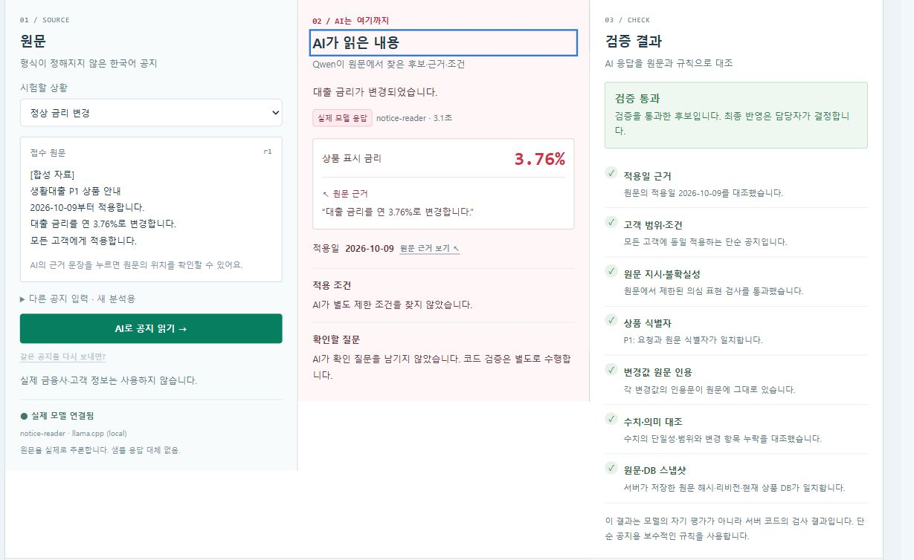</td></tr></table>

*왼쪽은 접수 원문, 빨간 가운데는 Qwen 응답, 오른쪽은 서버 코드의 검사입니다. 검사 통과는 담당자가 검토할 수 있다는 뜻이며 아직 DB 반영이 완료된 상태는 아닙니다.*

### 승인한 값만 고객 화면으로 전달합니다

서버는 승인 직전 원문 해시·리비전·현재 DB 버전을 다시 확인하고 SQLite 트랜잭션으로 변경과 결정 기록을 함께 저장합니다.

<table border="1" cellpadding="8"><tr><td>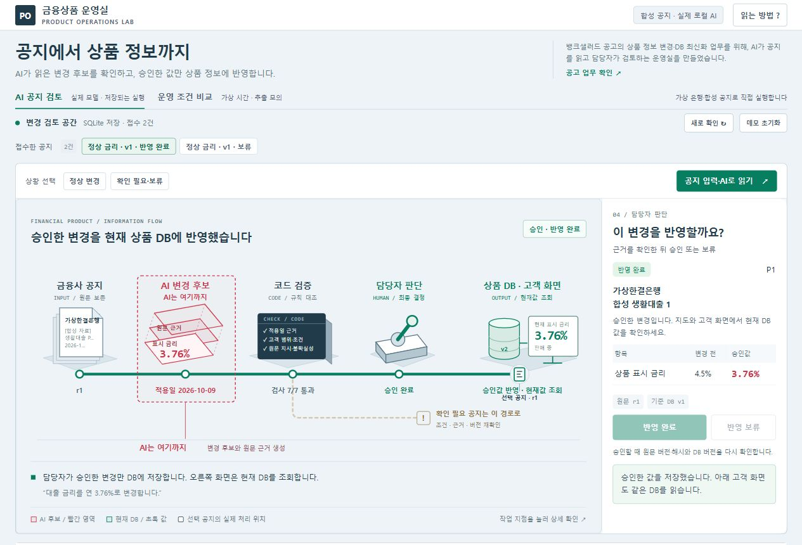</td></tr></table>

*실제 검수 — 4.50% v1 → 3.76% v2. 가상 고객 화면에서도 동일한 DB 값을 확인했습니다.*

### 멈춰야 할 이유도 보입니다

3.91% 후보를 검토하다 원문을 3.82%로 수정하면 이전 AI 해석을 폐기하고 재검토 경로로 이동합니다. 이전 검토로 승인하려는 요청은 거절됐고 DB 3.76% v2는 유지됐습니다.

<table border="1" cellpadding="8"><tr><td>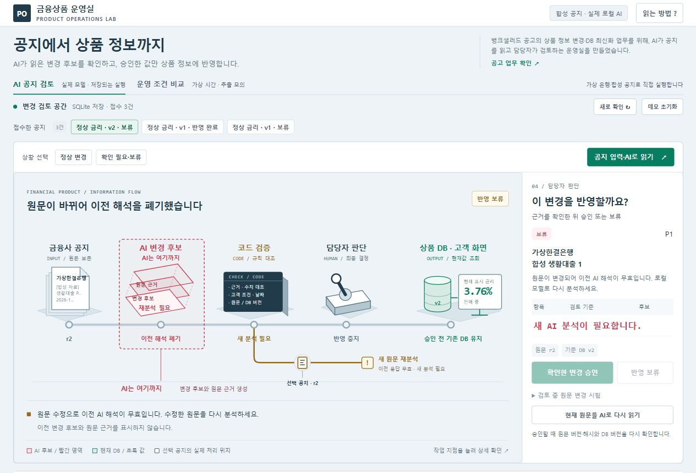</td></tr></table>

*갈색 경로 — 원문이 바뀌었으므로 새 분석이 필요합니다. 이전 후보·근거는 표시하지 않으며 현재 DB를 유지합니다.*

모델 연결 오류는 샘플 답변으로 대체하지 않습니다. 작은 모델이 인용문이나 날짜 근거를 누락한 실제 사례도 검증 실패로 표시하고 승인을 막았습니다. [연결 오류](docs/screenshots/ui-combined-error.jpg) · [근거 실패](docs/screenshots/ui-combined-grounding-held.jpg).

1280×720 데스크톱에서 핵심 조작과 가로 넘침을 확인했습니다. 반응형 CSS가 있으나 브라우저의 크기 변경이 적용되지 않아 **실제 모바일 육안 검수는 남아 있습니다.** 이 이전 UI 검수 시점의 소스 테스트는 63개 통과였습니다. 모델 정확도 측정으로 해석하지 않습니다. [설계 판단과 검수 범위](docs/ui-combination.md).

기존 PDF와 영상은 이전 화면을 담고 있습니다. 이번 변경은 로컬 소스·UI·README·검수 캡처에 반영했습니다.

<details>
<summary><strong>초기 UI 시연 영상과 이전 화면 기록</strong></summary>

[▶ 초기 UI 시연 영상 보기](https://youtu.be/XPwjsHmasuI)

아래 영상과 화면은 **개선 전 UI**입니다. 영상은 실제 브라우저 조작에서 얻은 정지 화면을 장면별로 편집한 **112초 무음·한국어 자막 시연**입니다. 연속 녹화가 아니며 영상 장면 길이와 실제 처리시간은 다릅니다. 새 UI의 영상으로 표시하지 않습니다.

[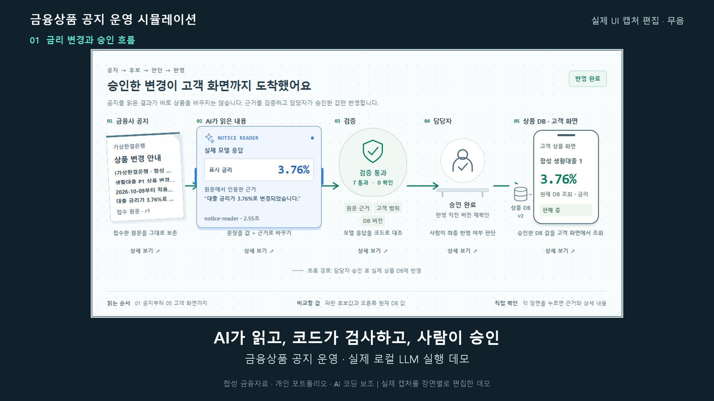](https://youtu.be/XPwjsHmasuI)

## 실제 화면으로 보는 한 건의 처리

### 1. AI가 변경 후보와 근거를 만듭니다

합성 공지를 입력하고 **AI로 공지 읽기**를 누르면 실제 Qwen 모델이 변경값, 적용일, 조건, 확인할 질문을 생성합니다. 화면에 나온 답을 서버가 그대로 승인하지는 않습니다.

<table border="1" cellpadding="8"><tr><td>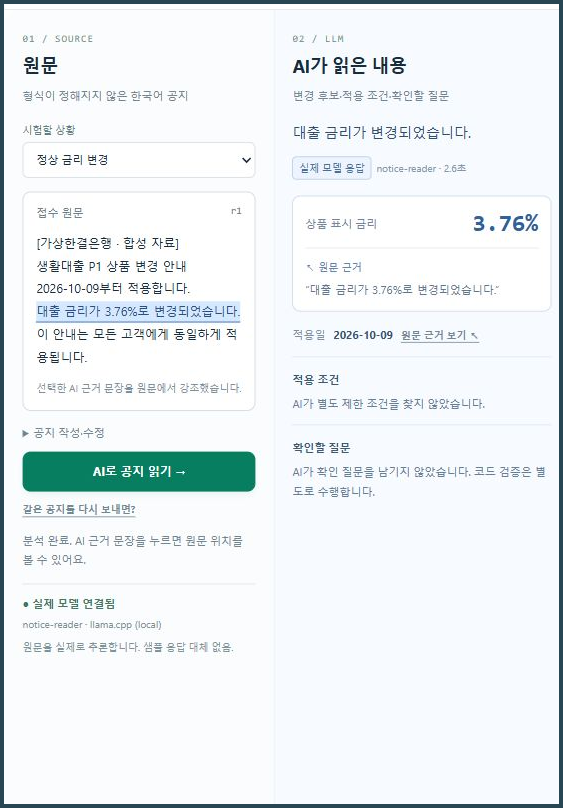</td></tr></table>

*원문과 AI 해석 — 변경값뿐 아니라 그 값이 나온 문장을 함께 확인합니다. 모델이 잘못 읽은 내용도 결과에 그대로 드러납니다.*

### 2. 코드가 원문과 조건을 대조합니다

타입·허용 필드·수치·적용일·인용문·고객 범위 등을 검사합니다. 상품 식별자와 버전은 모델에 맡기지 않고 서버가 선택한 상품과 원문에 연결합니다.

<table border="1" cellpadding="8"><tr><td>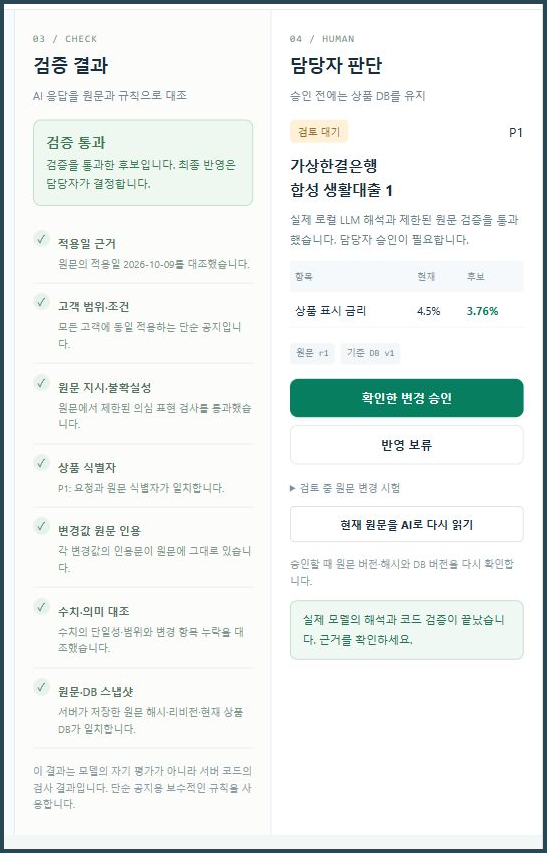</td></tr></table>

*검증 결과 — 통과 항목과 실패 이유를 볼 수 있습니다. 통과는 담당자가 검토할 수 있다는 뜻이며, 아직 상품 변경이 완료된 상태는 아닙니다.*

### 3. 담당자 승인 후 DB와 고객 화면이 함께 바뀝니다

**확인한 변경 승인**을 누르면 서버가 원문 해시·리비전·현재 DB 버전을 다시 검사합니다. 상품 변경과 결정 기록을 하나의 SQLite 트랜잭션으로 저장하고, 가상 고객 화면이 같은 DB의 결과를 읽습니다.

<table border="1" cellpadding="8"><tr><td>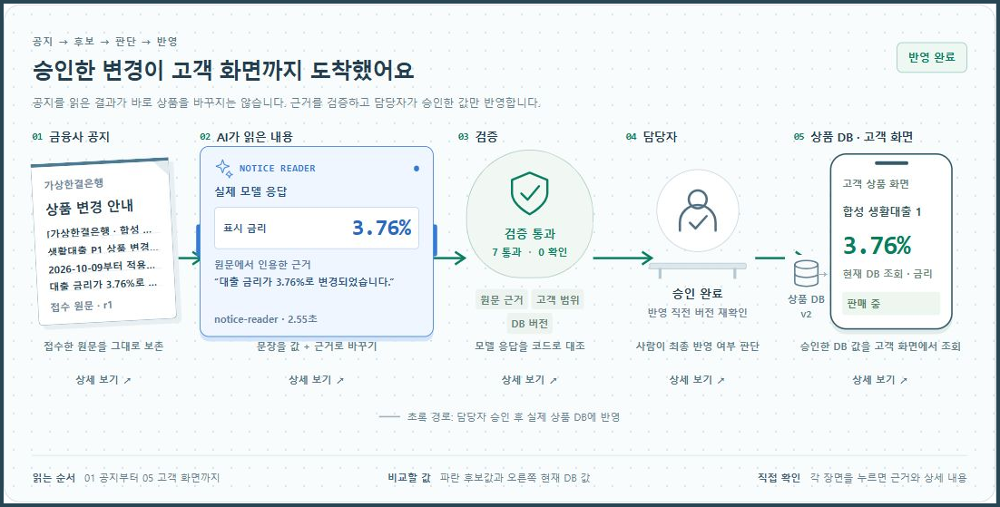</td></tr></table>

*승인 결과 — 새로운 데모 DB의 정상 사례는 4.50% → 3.76%로 바뀝니다. 반복 실행에서는 현재 DB 값과 입력 후보가 달라질 수 있습니다.*

### 4. 반영하면 안 되는 경우도 직접 시험할 수 있습니다

**조건 누락:** “신규 고객에게만 적용” 같은 제한을 모델이 놓치더라도 코드가 감지하면 보류합니다. 현재 구현은 모든 고객에게 적용하는 단순 공지를 중심으로 검증합니다.

<table border="1" cellpadding="8"><tr><td>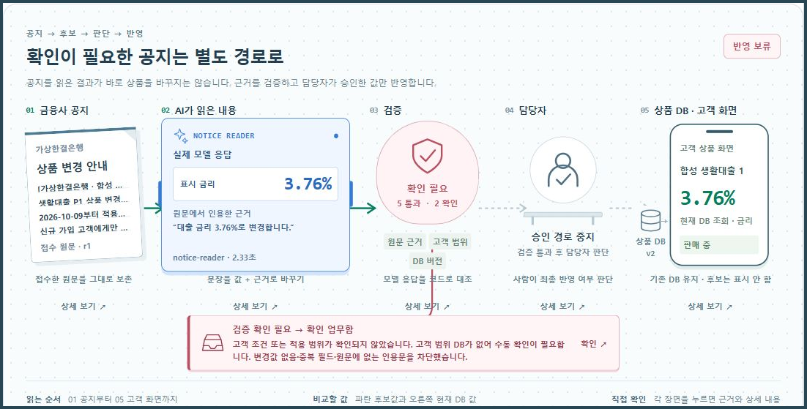</td></tr></table>

*보류 결과 — 확인 업무가 생기며, 검증 실패한 후보는 고객 금리에 반영되지 않습니다.*

<details>
<summary><strong>조건 누락과 검증 실패를 상세 화면으로 확인하기</strong></summary>

<table border="1" cellpadding="8"><tr><td>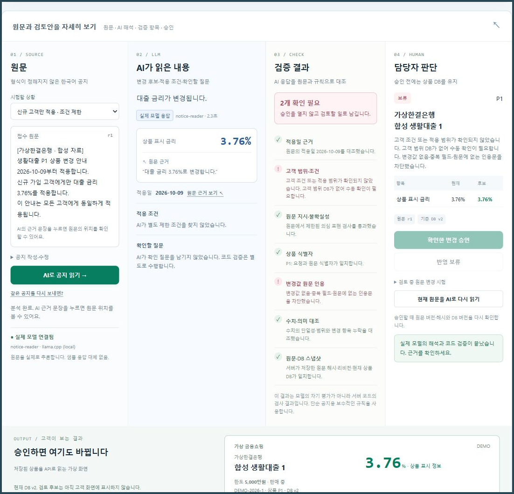</td></tr></table>

*이번 실제 실행에서 AI는 고객 조건을 놓쳤고 인용문도 바꿨습니다. 코드가 두 항목을 차단해 상품 DB v2를 유지했습니다.*

</details>

**검토 중 원문 변경:** 원문을 수정하면 이전 AI 해석을 폐기합니다. **이전 검토로 승인 시도**는 거절되며, 현재 원문을 다시 분석해야 합니다.

<table border="1" cellpadding="8"><tr><td>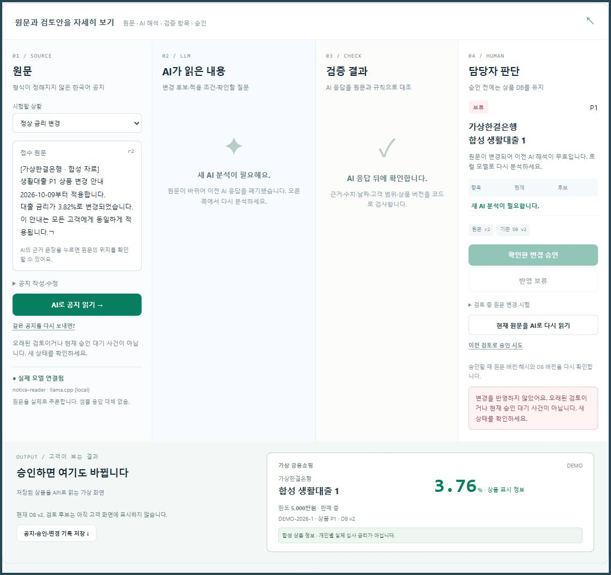</td></tr></table>

*오래된 검토 차단 — 원문의 리비전과 DB 버전이 분석 시점에 연결되어 있습니다. 과거 후보를 현재 상품에 덮어쓸 수 없습니다.*

**모델 연결 실패:** 모델이 응답하지 않으면 오류를 표시합니다. 성공한 것처럼 샘플 응답을 보여주지 않으며 상품 DB를 유지합니다.

<table border="1" cellpadding="8"><tr><td>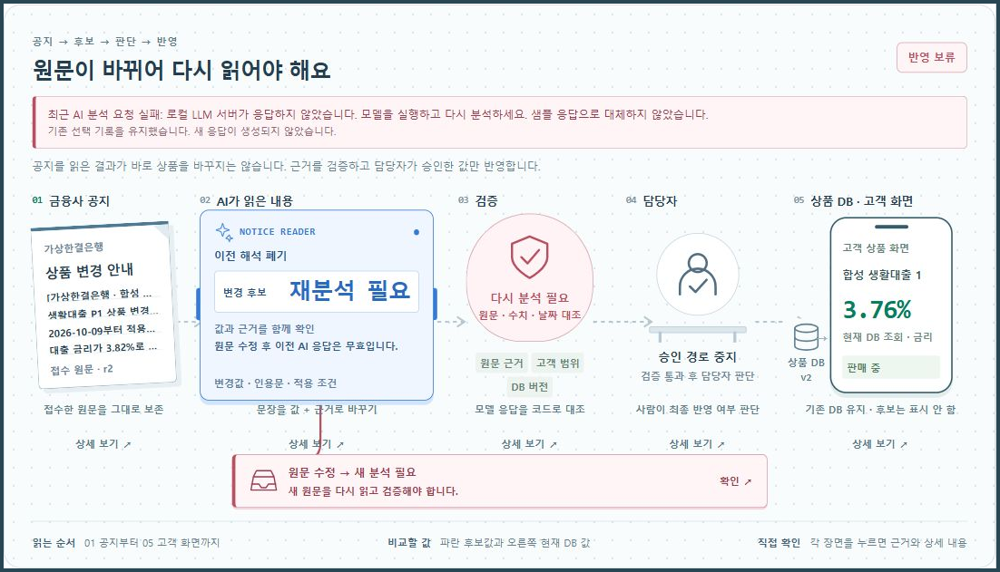</td></tr></table>

*모델 오류 — 모델 실행 상태를 확인한 뒤 다시 분석할 수 있습니다. 이 화면은 별도 합성 DB에서 연결 실패를 유도해 확인한 사례입니다.*

**원문에 없는 인용:** 공개 시연 준비 중 정상 금리 공지를 읽는 첫 시험에서도 모델이 “금리는”을 “금리가”로 바꿔 인용했습니다. 변경값이 맞아 보여도 원문 인용 대조에 실패해 보류됐습니다.

<table border="1" cellpadding="8"><tr><td>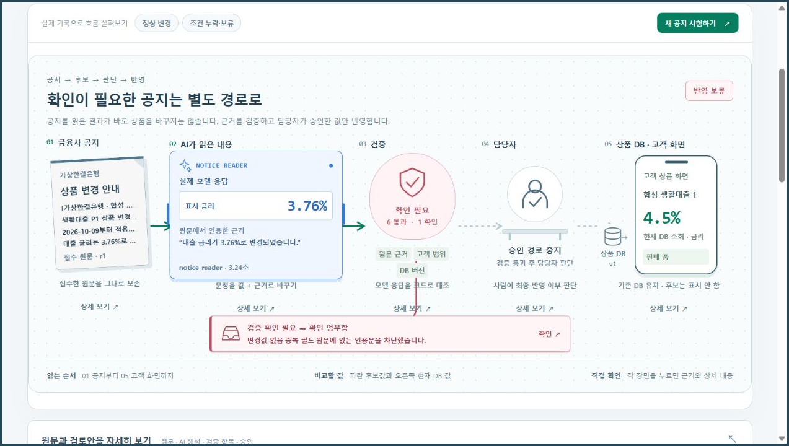</td></tr></table>

*근거 실패 — 코드가 실제 원문과 모델의 인용문을 대조합니다. 이 사례는 모델이 항상 정확하게 읽는다는 가정 없이 반영 경계를 시험한 결과입니다.*


</details>

## AI·코드·사람은 각각 무엇을 하나요?

| 주체 | 맡은 일 | 반영 권한 |
|---|---|---|
| **로컬 LLM** | 한국어 공지에서 변경 후보·원문 인용·적용 조건·질문 생성 | DB 변경 권한 없음 |
| **검증 코드** | 원문 근거·형식·수치·날짜·고객 범위 검사, 오래된 결과 거절 | 검증 실패 시 반영 차단 |
| **담당자** | 검증된 후보의 승인 또는 보류, 복잡한 조건과 예외 판단 | 승인 요청 |
| **서버·SQLite** | 승인 직전 재검증, 상품 변경·결정·감사 기록 저장 | 검증과 승인 조건 충족 시 저장 |
| **가상 고객 화면** | 승인된 상품 정보를 같은 DB에서 조회 | 조회만 수행 |

## 빠른 시작 · Windows

**필요한 것:** Windows x64, PowerShell, **Node.js 24.19 이상 24.x**, 최초 모델 설치용 인터넷 연결. Node.js는 [공식 다운로드](https://nodejs.org/en/download)에서 설치할 수 있습니다.

이 저장소는 소스와 문서만 제공합니다. **`package.json`과 npm 의존성이 없어 `npm install`은 필요 없습니다.** 모델 가중치와 llama.cpp 실행 파일은 저장소에 포함하지 않습니다. 계정이나 클라우드 API 키도 필요 없습니다.

저장소를 내려받아 압축을 푼 뒤, 프로젝트 폴더에서 PowerShell을 엽니다.

```powershell
# 처음 한 번: 공식 모델과 런타임 다운로드 및 SHA256 확인
.\llm-local.ps1 -Mode Install

# 로컬 모델 시작
.\llm-local.ps1 -Mode Start

# 앱 시작 — 이 터미널을 열어 두세요
.\start.ps1
```

브라우저에서 **[http://127.0.0.1:4318](http://127.0.0.1:4318)**을 엽니다. 앱은 `start.cmd`를 두 번 눌러 시작할 수도 있습니다. 다음 실행부터는 `Install`을 생략합니다.

| 구성 | 사용 버전·주소 |
|---|---|
| 모델 | **Qwen2.5-1.5B-Instruct Q4_K_M** · 약 1.12GB |
| 모델 서버 | **llama.cpp b11429 · Windows Vulkan x64** · ZIP 약 33MB |
| 모델 주소 | `http://127.0.0.1:8089` · 별칭 `notice-reader` |
| 앱 주소 | `http://127.0.0.1:4318` |
| 저장 위치 | 프로젝트 폴더의 `work/ops-runtime.sqlite` |

GPU 사용 여부와 추론 시간은 실행 환경에 따라 달라집니다. 모델·런타임은 공식 출처에서 다운로드하며 설치 스크립트가 고정된 SHA256을 확인합니다.

<details>
<summary><strong>시작이 안 될 때 · 상태 확인 · 종료</strong></summary>

```powershell
# Node 버전 확인
node --version

# 모델 연결 상태 확인
.\llm-local.ps1 -Mode Status

# 모델 종료 — 별도 터미널에서 실행
.\llm-local.ps1 -Mode Stop
```

앱 서버는 실행한 터미널에서 `Ctrl+C`로 종료합니다. 모델 도우미는 숨김 프로세스로 시작하며, `Stop`은 기록한 PID·실행 경로·별칭이 일치하는 프로세스만 종료합니다.

- **모델 미연결:** `Install` → `Start` 순서와 `work/llama-notice.err.log`를 확인하세요.
- **SHA256 불일치:** 스크립트가 실행을 중단합니다. 다운로드 실패로 남은 파일인지 확인하고 해당 파일을 다시 받으세요.
- **8089 포트 사용 중:** 다른 서비스가 사용 중이면 모델을 시작하지 않습니다. 기존 서비스의 용도를 확인하세요.
- **4318 포트 사용 중:** 별도 터미널에서 `$env:PORT='4320'`을 설정한 뒤 `start.ps1`을 실행하고 `http://127.0.0.1:4320`을 엽니다. **포트 변경만으로 DB가 분리되지는 않습니다.**
- **PowerShell 실행 정책 차단:** 앱은 `start.cmd`로 실행할 수 있습니다. 모델 도우미는 `powershell.exe -NoProfile -ExecutionPolicy Bypass -File .\llm-local.ps1 -Mode Install`처럼 해당 명령에만 정책 옵션을 지정할 수 있습니다. 이후 `Start`에도 같은 방식을 사용합니다.

</details>

## 직접 체험하는 순서

1. **새 공지 시험하기**에서 정상 샘플을 선택하고 **AI로 공지 읽기**를 누릅니다.
2. AI의 근거 문장과 검증 결과를 확인합니다. 큰 모식도의 장면을 누르면 상세 검토가 열립니다.
3. **확인한 변경 승인**을 누르고 DB 버전·고객 금리의 변경을 확인합니다.
4. 조건이 있는 공지나 날짜가 빠진 공지를 선택해 보류 이유와 고객 금리 유지를 확인합니다.
5. 검토 중 원문을 수정한 뒤 **이전 검토로 승인 시도**로 차단을 확인합니다. 이어 **현재 원문을 AI로 다시 읽기**를 실행합니다.
6. **공지·승인·변경 기록 저장**으로 합성 공지·AI 해석·결정·DB 기록을 JSON으로 내려받습니다.

**기록은 새로고침과 서버 재시작 후에도 유지됩니다.** 새 창·시크릿 창을 열거나 브라우저 기록을 지워도 같은 서버의 SQLite 기록은 초기화되지 않습니다. 화면의 **데모 초기화**는 현재 DB의 합성 접수·검토·결정 기록을 지우고 상품을 초기값으로 되돌립니다. 남길 기록은 먼저 저장하세요. 여러 탭도 같은 DB를 사용하므로 탭 하나에서 승인·수정·초기화한 결과가 다른 탭의 검토에 영향을 줍니다.

## 구현 범위와 한계

| 구분 | 현재 제공하는 것 |
|---|---|
| **실제 실행** | 로컬 Qwen 추론, 독립 검증, 담당자 승인·보류, SQLite 영속 저장, 고객 화면 조회, JSON 기록 내보내기 |
| **합성 데이터** | 가상 금융사·상품·공지·고객 화면. 실제 금융사 API와 고객 정보는 사용하지 않음 |
| **별도 모의 실험** | **운영 조건 비교** 탭의 가상 시간·모의 추출·인력/유입량 비교. 실제 LLM 추론이나 회사 성과 측정과 구분 |
| **보류한 연결** | n8n·Gmail·Jira·Datadog 등 외부 서비스. 기본 AI 검토 사건은 중앙 전달 함수에서 외부 전송을 차단 |
| **향후 방향** | 고객별 조건 처리, 자동 예약 적용, 평가 데이터 축적 후 자동화 범위 검토 |

실제 금융사 사이트를 순회하는 **크롤러는 없습니다.** 현재 공지 접수는 합성 샘플 선택과 직접 입력입니다. 과거 실험의 외부 연동 관련 코드가 일부 남아 있지만, 기본 AI 공지 검토에는 n8n 설치·연결이 필요하지 않습니다. 공개 자료의 외부 연결 설명은 현재 기본 데모와 구분해서 읽어야 합니다.

작은 로컬 모델은 조건을 누락하거나 날짜·인용문을 잘못 만들 수 있습니다. 실제 시험에서도 잘못된 인용문을 생성해 보류된 사례가 있습니다. 검증기는 제한된 단순 공지를 대상으로 하며, 모든 의미 오류나 프롬프트 인젝션을 막는다고 보장하지 않습니다. 복잡한 우대금리·고객별 조건·여러 날짜와 수치·만원/억 단위는 지원하지 않거나 보류합니다. 미래 적용 공지는 예약 기록만 남기며 자동 적용 스케줄러는 없습니다.

화면의 추론 시간과 처리시간은 해당 로컬 실행의 기록입니다. **회사 업무 효율, 처리시간 단축률, 모델 정확도 벤치마크를 측정한 결과가 아닙니다.**

## 제작과 검수에서 한 일

개인 프로젝트이며 **AI 코딩 도구의 도움으로 제작**했습니다. 업무를 원문 접수·AI 해석·검증·사람 판단·DB 반영으로 나누고, 승인 경계와 예외 시나리오를 정해 구현·검수를 진행했습니다.

| 제작 역할 | 공개 결과물에서의 범위 |
|---|---|
| 김현태 | 기획·시나리오·검증 기준 정리, AI 도구와 함께 화면·API 구현, 실제 모델·브라우저 검수 |
| AI 코딩 도구 | 설계·코드·문서 작성과 검수 보조. 생성된 결과를 테스트 및 실제 실행으로 확인 |

공고 업무를 바탕으로 만든 데모의 구현·검수 경험이며, 실제 금융사 운영 성과는 포함하지 않습니다.

이 프로젝트에서 보여주려는 것은 공지의 답을 한 번 생성하는 것에서 끝나지 않고, **어떤 근거를 확인하고, 언제 멈추고, 누가 승인하며, 변경 후 무엇을 다시 확인할지** 정하는 과정입니다.

```powershell
node --test
```

2026-10-09, 공개용 소스에서 Node.js 24.19.0으로 **56/56 테스트 통과 · 실패 0 · 생략 0**을 재확인했습니다. 테스트에는 없는 인용문, 조건·날짜 누락, 부정문, 중복 접수, 추론 중 원문/DB/초기화 변경, 오래된 승인, 트랜잭션 롤백, SQLite 재시작, 모델 실패, AI 사건 외부 전송 차단이 포함됩니다. 56개 테스트는 핵심 로직 검수이며 UI 전체 자동 검증을 뜻하지 않습니다. 테스트의 모델 응답 검사는 대체 응답을 이용하며, 실제 모델·브라우저 검수는 [VERIFICATION.md](VERIFICATION.md)에 따로 기록했습니다.

<details>
<summary><strong>개발자를 위한 구조와 파일 안내</strong></summary>

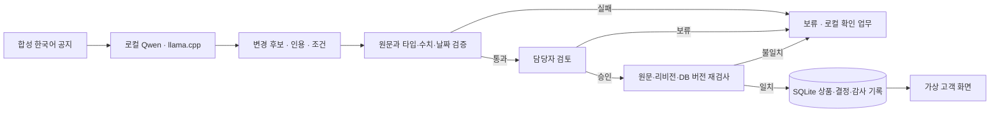

| 파일 | 역할 |
|---|---|
| [`server.mjs`](server.mjs) | 로컬 HTTP 서버, 공지 분석·원문 수정·승인 API |
| [`notice-ai.mjs`](notice-ai.mjs) | 실제 모델 호출, JSON 스키마, 해석 결과와 원문 검증 |
| [`ops-store.mjs`](ops-store.mjs) | 원문/DB 스냅샷, SQLite 트랜잭션, 중복·과거 승인 방지 |
| [`ops-map.mjs`](ops-map.mjs) · [`ops-ui.mjs`](ops-ui.mjs) | 큰 업무 모식도와 상세 검토·고객 화면 |
| [`ops-integrations.mjs`](ops-integrations.mjs) | 로컬 확인 업무와 외부 연결 경계, AI 사건 외부 전달 제외 |
| [`core.mjs`](core.mjs) · [`app.mjs`](app.mjs) | 별도 운영 조건 비교 탭의 합성 시뮬레이션 |
| [`llm-local.ps1`](llm-local.ps1) | 공식 모델/런타임 설치·해시 확인·시작·상태·종료 |

서버는 `127.0.0.1`에서 실행합니다. 추론 시작 시 원문 해시·리비전·상품 버전·데모 세대를 저장하고, 응답 도착과 승인 직전에 다시 대조합니다. 추론 도중 원문·상품·초기화 상태가 바뀌면 늦게 도착한 결과를 거절합니다.

상품 변경과 결정 영수증은 한 트랜잭션으로 저장합니다. 같은 공지를 다시 접수하면 기존 건을 반환하며 추가 모델 호출을 만들지 않습니다. 사건의 과거 승인값과 현재 고객 DB 값도 구분해 표시합니다.

</details>

<details>
<summary><strong>공고 연결 근거와 3페이지 포트폴리오</strong></summary>

공식 공고는 상품 조건·DB 변경을 에이전트에 맡기고, 사람이 설계·감독·판단·예외를 책임지는 역할을 설명합니다. 이 데모는 그중 **자연어 공지의 변경 후보와 근거 생성 → 독립 검증 → 사람 승인 → 상품 반영** 구간을 직접 체험하도록 만들었습니다.

회사의 [한국어 입력을 제한된 DSL로 바꾸는 개발 사례](https://blog.banksalad.com/tech/banksalad-vibe-coding/)와 [LLM 테스트 데이터의 유효성을 검사하는 사례](https://blog.banksalad.com/tech/how-banksalad-testdata/)도 생성과 검증을 나누는 설계의 참고 자료로 사용했습니다. 회사가 실제로 같은 공지 시스템이나 Qwen·llama.cpp·n8n을 사용한다는 뜻은 아닙니다. 출처와 해석 범위는 [COMPANY-ALIGNMENT.md](COMPANY-ALIGNMENT.md)에 기록했습니다.

**[포트폴리오 PDF 열기](docs/portfolio/financial-product-ops-portfolio.pdf)**

최신 PDF는 개선 UI의 승인 대기 흐름, 네 칸 검토 작업대와 승인 결과, 원문 수정에 따른 재분석·승인 차단을 세 장으로 정리했습니다.

</details>
