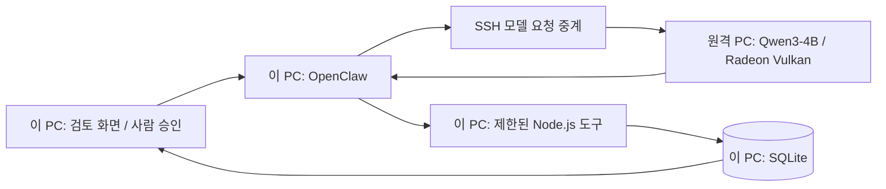

# OpenClaw 금융상품 조사 Agent

공고의 경쟁상품 조건 추적·상품 DB 최신화 업무를 위해, 공지를 읽고 검토 후보를 만드는 도구 Agent를 구현했습니다. 회사 내부 시스템을 재현했다고 주장하지 않는 개인 합성 데이터 데모입니다.

## 한 건의 읽는 순서

1. 사용자가 제휴 공지 조사·경쟁상품 조사·공개 페이지 읽기 중 작업을 선택합니다.
2. OpenClaw가 Qwen에 작업과 도구 명세를 전달합니다. 모델이 **native `tool_calls`**로 도구와 입력을 선택합니다.
3. Node.js 도구가 원문을 수집해 결과를 돌려줍니다. 모델은 결과를 읽고 다음 도구를 요청합니다.
4. AI가 금리·적용일·정확한 원문 인용을 제안하면 코드가 근거·출처·상품·날짜·DB 버전을 검사합니다.
5. 담당자가 화면에서 승인합니다. **사람 승인 도구는 AI에게 제공하지 않습니다.**
6. 별도 반영 요청에서 Agent가 반영 도구를 호출합니다. 도구가 승인 바인딩과 최신 원문을 재확인한 뒤 SQLite를 변경합니다.

AI의 역할은 **도구 선택 → 반환된 원문 해석 → 변경 후보와 근거 생성 → 결과에 따른 다음 호출**입니다. 다운로드·HTTP 읽기·규칙 검사·DB 쓰기는 프로그램이 실행합니다. 24시간 크롤링이나 상시 감시 스케줄러는 현재 구현 범위에 포함되지 않습니다.

## 컴퓨터 두 대의 역할



모델이 가장 많은 RAM을 사용하므로 원격 PC에서 실행합니다. 두 PC의 RAM을 합치는 방식이 아닙니다. 원격 SSH 서버에서 포트 전달이 금지돼 있어 기존 SSH 명령 연결의 stdin/stdout으로 모델 요청·응답을 전달합니다. SSH 서버 설정이나 방화벽은 수정하지 않았습니다.

실제 검수 환경은 AMD Radeon 내장 그래픽의 Vulkan 장치를 확인한 뒤 사용했습니다. GPU 설정만으로 처리속도나 다른 환경의 호환성을 보장하지 않습니다. 컨텍스트를 4096으로 제한하고 시작 전 최소 4.5 GiB 여유 RAM을 확인합니다. 기본 8192 설정에는 5 GiB가 필요합니다. 이미 같은 작업의 모델이나 지정 포트가 실행 중이면 시작을 거부하며 기존 PID·실행 기록을 덮어쓰지 않습니다.

원격 모델 주소는 `127.0.0.1:8096`, 이 PC의 중계 주소는 `127.0.0.1:8090`입니다. 원격 요청 프로그램은 `/health`, `/v1/models`, `/v1/chat/completions` 세 경로만 고정 모델에 전달하며, 입력에서 실행 명령·외부 URL을 받지 않습니다. SSH 개인키는 경로로만 사용하고 전송하지 않습니다.

## 제공한 도구와 권한

| 도구 | 실행하는 프로그램의 역할 | 제한 |
|---|---|---|
| `finance_sources` | 등록한 출처 목록 조회 | URL을 임의로 추가할 수 없음 |
| `finance_fetch` | 등록 출처의 HTTP 본문·해시·시각 보관 | 선택한 업무의 출처만 읽음, 리다이렉트 거부 |
| `finance_snapshot` | 현재 상품 DB 조회 | 제휴 상품 조사에서만 사용 |
| `finance_propose` | AI 후보와 원문 근거 검증·검토 대기 생성 | 선택한 출처의 보관 원문만 사용, 직접 DB 반영 없음 |
| `finance_apply` | 승인·원문·DB 버전 재검사 후 트랜잭션 반영 | 반영 작업에서 지정한 후보만, 저장된 사람 승인 필요 |
| `finance_report` | 실제 오류·검토 사유를 로컬 기록 | 외부 발송 없음 |

매 실행의 도구 요청에는 다른 임시 권한을 사용합니다. 느린 요청이 다음 실행에 기록되지 않도록 요청을 원래 실행에 묶습니다. CLI 종료 후에도 진행 중인 도구가 반환되기 전에는 다음 작업을 시작하지 않습니다.

OpenClaw 공식 `before_prompt_build` 훅으로 금융 업무에 필요한 지침을 전달하고, 작업마다 도구 목록을 좁힙니다. 공개 페이지 읽기에는 수집·보고만, 승인 건 반영에는 지정 후보의 반영·보고만 제공합니다. 모델 지침 외에 HTTP 도구 서버도 같은 작업 범위와 임시 실행 권한을 검사합니다.

## 실행

필요 도구: Windows, Node.js 24.16 이상 25 미만, OpenClaw 2026.9.9, 공식 llama.cpp b11429, Qwen GGUF. 다운로드한 모델과 런타임의 SHA256을 확인합니다.

로컬 작은 모델 경로:

```powershell
powershell -NoProfile -File agent/start.ps1 -Install
```

로컬 1.7B는 설치·native 호출 실험용입니다. 전체 Agent 업무를 안정적으로 완료했다고 보장하지 않습니다. 원격 4B 경로는 다음처럼 구성합니다. 호스트·계정·키 경로·검증된 known_hosts 경로는 자신의 환경값을 사용합니다.

```powershell
# 원격 작업 폴더에 공식 런타임 ZIP, 모델 GGUF와 아래 두 스크립트를 복사합니다.
# 원격 PC에서 모델 실행 (SSH 세션을 유지)
# GPU 장치와 여유 RAM을 먼저 확인한 환경: 포트 / CPU 스레드 / GPU layers / context
node remote-model.mjs C:/CodexResourceShare/jobs/finance-agent-20261010 8096 4 99 4096

# 이 PC에서 SSH 요청 중계 실행 (별도 터미널)
node agent/remote-proxy.mjs HOST USER KEY_PATH KNOWN_HOSTS_PATH C:/CodexResourceShare/jobs/finance-agent-20261010

# 이 PC에서 OpenClaw 설정과 콘솔 실행 (별도 터미널)
powershell -NoProfile -File agent/start.ps1 -UseExistingModel -ModelName 'Qwen3-4B Q4_K_M' -ModelCompute 'remote-pc' -ModelBackend Vulkan -ModelContext 4096
```

원격 폴더에는 `remote-model.mjs`, `remote-request.mjs`, `Qwen3-4B-Q4_K_M.gguf`, `llama-b11429-bin-win-vulkan-x64.zip`이 필요합니다. OpenClaw를 처음 설치할 때는 마지막 명령에 `-Install`도 넣습니다. 모델 프로세스·명령·해시·로그는 원격 폴더에 기록됩니다. 개인 모델·OpenClaw 상태·SQLite·키·런타임 다운로드 파일은 저장소에 포함하지 않습니다.

CPU로 실행할 때는 GPU layers를 `0`, `-ModelBackend`를 `CPU`로 맞춥니다. 원격 모델 컨텍스트와 OpenClaw의 `-ModelContext`는 같아야 합니다. 공식 모델: [Qwen3-4B-GGUF](https://huggingface.co/Qwen/Qwen3-4B-GGUF), 런타임: [llama.cpp b11429](https://github.com/ggml-org/llama.cpp/releases/tag/b11429).

콘솔: <http://127.0.0.1:4330/>. 종료는 각각의 실행 터미널에서 Ctrl+C를 사용합니다. 모델은 원격 실행 세션의 자식 프로세스이므로 종료 후 원격 PID·포트가 정리됐는지 확인합니다.

## 검증 범위와 한계

테스트 통과와 실제 모델 성공은 별도 근거입니다. 실행 기록은 실제 도구의 입력·반환값이며 모델 내부 사고 과정은 표시하지 않습니다. CLI가 정상 종료돼도 필요한 도구 결과가 없으면 업무 실패로 표시합니다.

모델의 마지막 설명도 검증된 데이터와 구분합니다. 실제 검수에서 금리가 4.5% → 3.76%로 내려가는 후보를 정확하게 만들었지만, 마지막 문장에서는 ‘인상’이라고 잘못 설명했습니다. 원문 답변은 수정하지 않고 미검증 설명으로 보존합니다. 화면의 변경값·승인·DB 상태와 업무 성공 판정에는 해당 문장을 사용하지 않습니다.

금리 변경 검증기는 명시된 **합성 공지 형식**을 대상으로 합니다. 모든 금융사의 PDF·웹페이지·복잡한 금리 조건을 일반적으로 판정하는 범용 엔진이 아닙니다. 실제 뱅크샐러드 공개 홈페이지 조회는 참고 원문 수집이며 그 페이지로 제휴 상품 금리를 바꾸지 않습니다. 경쟁상품 후보는 별도 조사 기록에 저장합니다.

공식 구현 참고: [OpenClaw 도구 플러그인](https://docs.openclaw.ai/plugins/tool-plugins), [로컬 모델](https://docs.openclaw.ai/gateway/local-models), [llama.cpp function calling](https://github.com/ggml-org/llama.cpp/blob/master/docs/function-calling.md). 적용 버전·실제 성공/실패·테스트 결과는 [검수 기록](../VERIFICATION.md)에 남깁니다.
